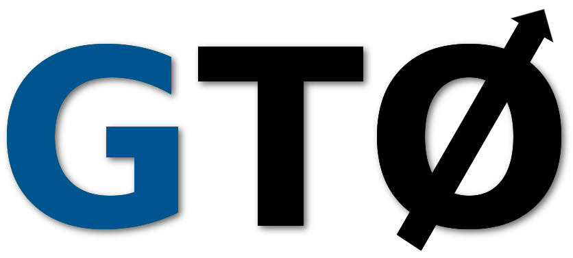

[](LICENSE)

<p align="center"></p>

<p align="center"><b>The genomics toolkit</b></p>
<br>

## INSTALL
Get GOOSE and make the project, using:
```bash
git clone https://github.com/pratas/GTO.git
cd GTO/src/
make
```
Note, an already compiled version of GTO is available for 64 bit Linux OS in
the `bin/` directory.


## INFORMATION

GTO provides pipes support for easy integration with other pipelines.
Moreover, there are many scripts to download sequences, shuffle, transform, etc.

## CITE
Please cite the followings, if you use GTO:
* J. R. Almeida, D. Pratas. GTO: a genomics toolkit, 2018.


## RELEASES
[Release](https://github.com/pratas/GTO/releases) 1.1


## ISSUES
Please let us know if there is any
[issues](https://github.com/pratas/GTO/issues).


## LICENSE
GTO is under MIT license. For more information, click
[here](https://opensource.org/licenses/MIT).


